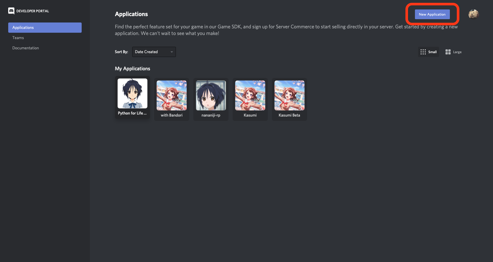
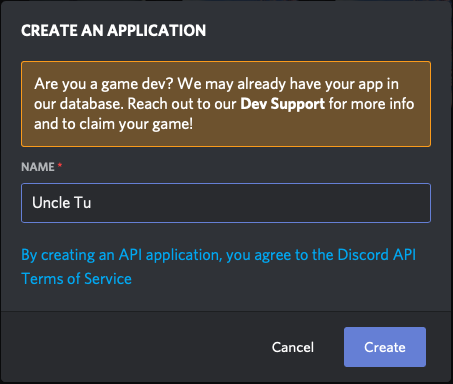
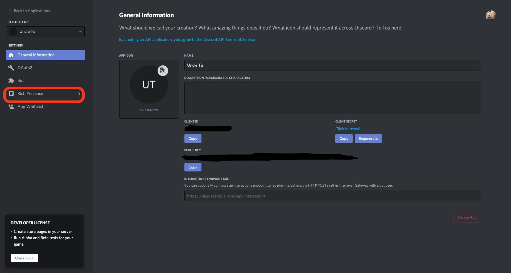
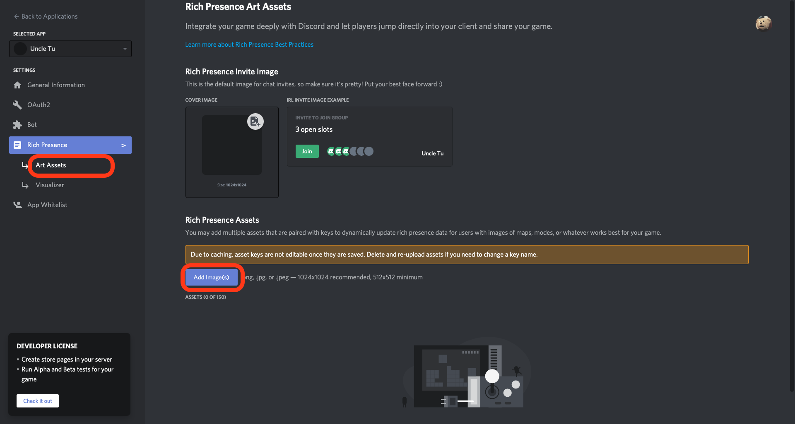
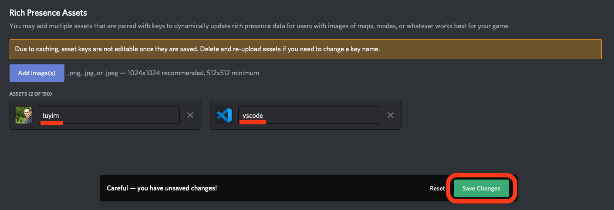
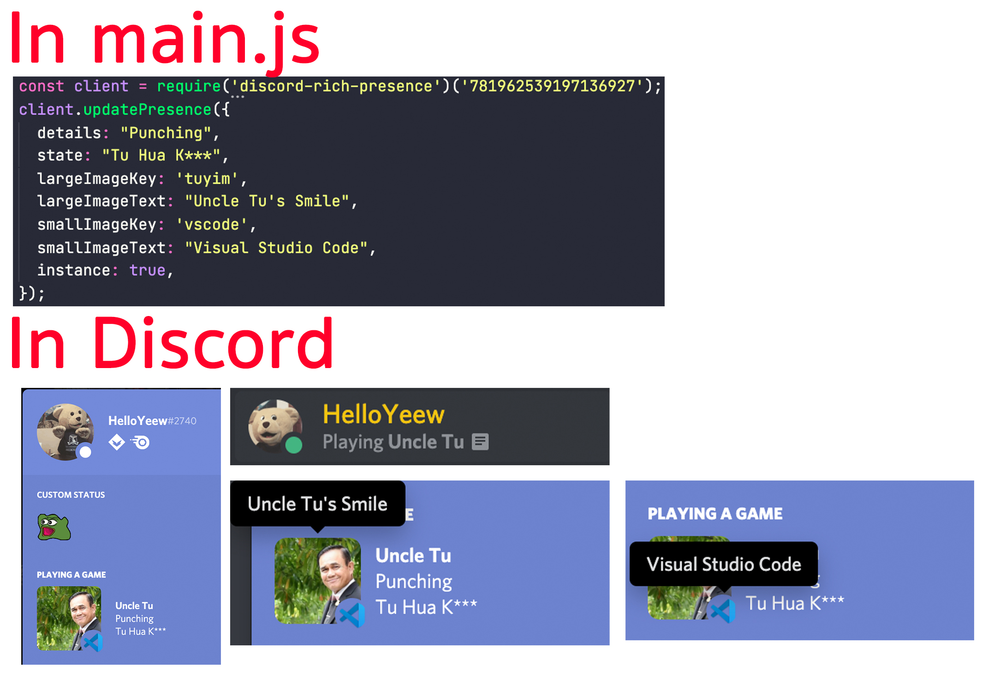
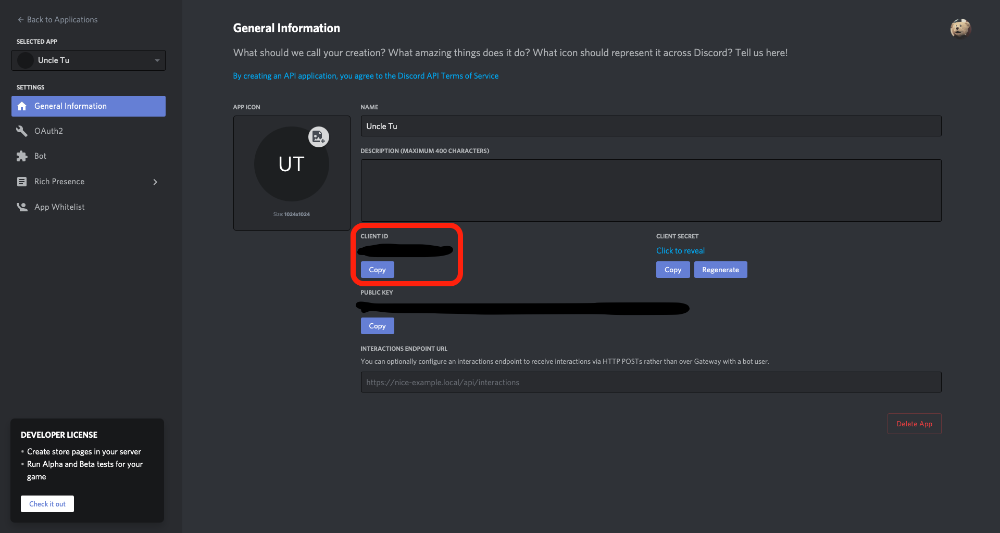

Other language

[Thai](README-th.md) *(Coming Soon)*

# My Custom Discord Rich Presence

Program for customize (or make) rich presence status in discord.

# Requirement

- [Node.js](https://nodejs.org/en/)
- Git (If you want to clone a repo.)

# How to use it

## Making your own rich presence

1. Go to [Discord Developer Portal](https://discord.com/developers/applications) and click **New Application** at top-right of the screen.


2. Fill an application name (This application name will be an application name that appear on your rich presence.)


3.This is an application dashboard. We are going to make a new rich presence application. Click **Rich Presence** menu.


4.Go to **Art Assets** under Rich Presence menu and click **Add Images** button to add your image in your rich presence. (Minimum resolution is 512x512 ,maximum resolution is 1024x1024 and a picture can be only .png .jpg and .jpeg)

I recommend that you must upload 2 photos. First photo for a big picture and second picture for small picture (like program icon)


5.After you upload please change your picture name to a word that you can memorize because this picture name will use for customize your rich presence program. (I will call this name as image key) and click **Save Changes**.

PS.After you save, you cannot change your image key so if you want to change your image key please delete and re-upload it again.


## Set up rich presence running program

1.Clone a repositories from GitHub

```zsh
git clone https://github.com/HelloYeew/my-custom-discord-rich-presence
```

Or download from [Release](https://github.com/HelloYeew/my-custom-discord-rich-presence/releases) page.

2.Get in folder and open main.js using text editor for config our rich presence. (All config description is already in JS files or you can see a config example here.)
You can use English or other language as much as you want.


3.Change ```id``` at the first line to your client ID in application dashboard. (It's all number.)


## Run a program

### On Macs

1.Open Terminal and get in folder
Ps. If you think a folder name is too long, you can rename it as ypou like.

```zsh
cd my-custom-discord-rich-presence
```

2.Run command to install npm packages

```zsh
npm install
```

3.Run our program

```zsh
sh start_mac.sh
```

4.Check your rich presence from discord!

### On Windows

1.Open Command Prompt or Powershell and get in folder

```shell
cd my-custom-discord-rich-presence
```

2.Run command to install npm packages

```shell
npm install
```

3.After complete close it and get in folder from Windows Explorer and open *start_win.bat*

4.Check your rich presence from discord!

## Warning!

- On both Macs and Windows if you close a terminal or command prompt (when you click open *start_win.bat*) It will stop your rich presence.
- If you close Discord, a program will auto stop.
- On Macs if you want to stop a program to config something in *main.js* you can click **Control + C** to stop a program and config something. After config you can run it again without closing a terminal. (In Windows just close Command Prompt and config then double click *start_win.bat* to open again.)
